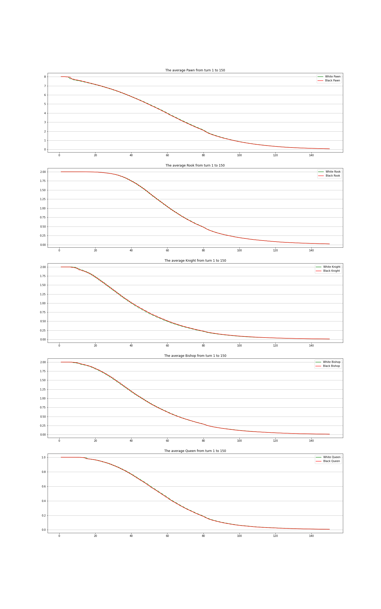
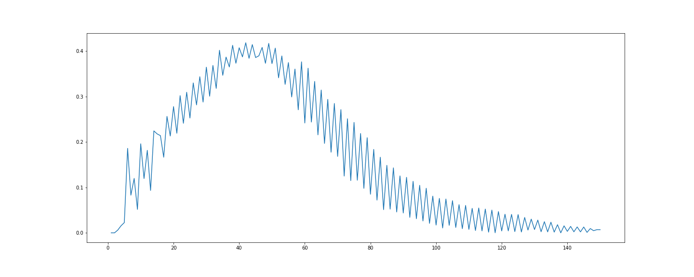
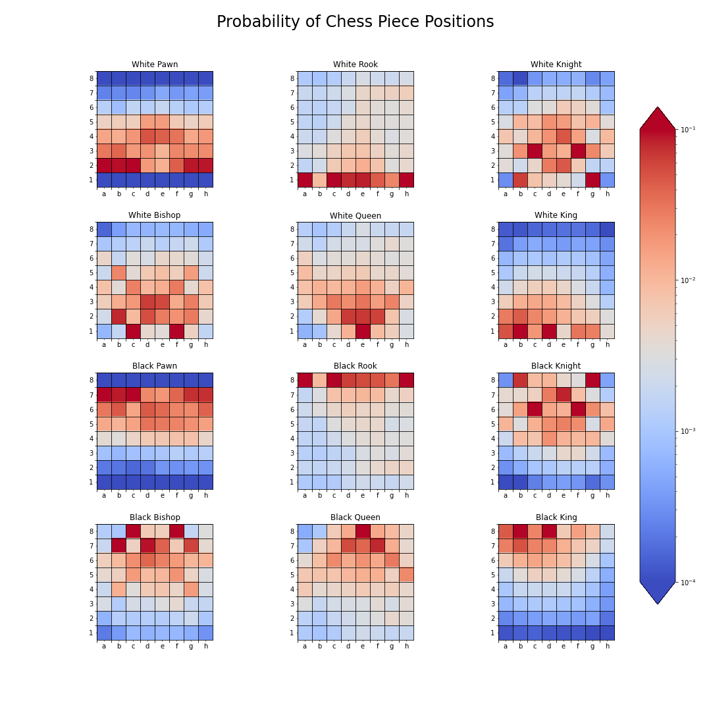

# chess-analysis
Quick analysis about chess game with some my insight

## Game count

The game count is 21587 games

## Chess result analysis

With draw result the file log is '1/2-1/2' with 8844 games, white win with '1-0' in 7589 games and black win with '0-1' in 5154 games

## Length of chess game

Averege length of chess game is 83 moves, which is equal to 41.5 turns

## Piece Analysis

The appearance of all 4 graphs of the rooks, knights, bishops , and queen are similar, the number of pieces is almost unchanged in the leading countries and decreases sharply in the middle. However, there is a difference in the number of leading moves where the pieces remain intact.

> For rooks, in the first 20 moves, almost no rooks were lost because of the peculiarity of the position of 2 rooks in the corner of the chessboard, so they did not participate much in the opening.

> Knight and bishop are similar to the first 6 moves, these are all opening moves. From the 10th to 20th moves, the number of knights and bishops tends to decrease sharply as players tend to exchange their pieces in these moves, signaling the end of the opening and the beginning of the middlegame.

> The average number of queen in the first 10 moves is still 1, however there is a sharp decline in moves between 15 and 20 possibly due to the players choosing to swap queens.

Unlike the other 4 graphs, the pawn graph decreases steadily with the number of moves, because the pawn is very actively involved on the board at almost all times.

## Piece Odd Between Two Player per Turn

The graph fluctuates because most of the lost pieces are due to the players choosing to trade each other's pieces. The gap increases sharply in countries move 30th to 50th, if it is not possible to end the game at this time, the players will come to the end of the game. As the graph shows, at this stage the difference in number and quality of pieces is very small.
## Piece Position Analysis

The middle pawns tend to participate in central control, especially d4, e4 with white pawns and d5, e5 with black pawns, the rest of the pawns don't move much to create a barrier to protect the champion. . Specifically, the common positions of the pieces can be analyzed

1. Rooks focus on moving in row 1 for white cars and row 8 for black cars due to the vehicle's mobility.

2. Knight taking part in the center with the pawns in the middle, the two favorite positions of the Knight are c3, f3 for white Knight and c6, f6 for black Knight

3. Bishop occupy large diagonals due to the ability of the net to move.

4. Queen moves many and varied on the chessboard.

5. The King is almost stationary in the whole match, the King has two favorite positions: the initial position and the position after merging into the wing.
